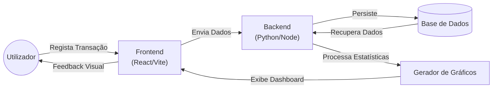

# FinanceApp

**Projeto Integrador III - UNIVESP (Turma 005 - 2026S1)**


https://github.com/user-attachments/assets/91365115-428f-4fef-b088-3659a86d583a

https://github.com/user-attachments/assets/6c19cb1b-ee11-4ece-ae23-ced2b093bf45


## Sobre o Projeto
O **FinanceApp** é um sistema de controlo de gastos pessoais desenvolvido para solucionar a dificuldade de gestão financeira individual. O foco do projeto é transformar registos brutos de receitas e despesas em informações visuais acionáveis, permitindo que o utilizador identifique padrões de consumo através de dashboards e gráficos interativos.

## Como Iniciar (Desenvolvimento)

Para rodar o projeto localmente usando Docker siga os passos abaixo:

### Pré-requisitos
- [Docker](https://docs.docker.com/get-docker/)
- [Docker Compose](https://docs.docker.com/compose/install/)
- [Make](https://www.gnu.org/software/make/) (opcional, mas recomendado)

### Passos
1. **Construir as imagens:**
   ```bash
   make build
   # ou: docker compose build
   ```

2. **Subir os serviços:**
   ```bash
   make up
   # ou: docker compose up -d
   ```

3. **Acessar as aplicações:**
   - **Frontend:** [http://localhost:3000](http://localhost:3000)
   - **Backend (API):** [http://localhost:8000](http://localhost:8000)
   - **Documentação API (Swagger):** [http://localhost:8000/docs](http://localhost:8000/docs)
   - **API Client (Bruno):** A coleção está na pasta `/bruno`

4. **Ver logs:**
   ```bash
   make logs
   # ou: docker compose logs -f
   ```

5. **Parar os serviços:**
   ```bash
   make down
   # ou: docker compose down
   ```


## Como Funciona (Fluxo)




### Fluxo de Funcionamento

* **Entrada de Dados**: O utilizador regista receitas e despesas, associando-as a categorias personalizadas que incluem ícones e cores para identificação visual[cite: 43, 269].
* **Processamento**: O sistema organiza os lançamentos cronologicamente e por categoria, armazenando as informações num banco de dados para garantir a integridade dos registos[cite: 43, 219].
* **Visualização**: Os dados são processados para gerar gráficos (como os de pizza para categorias e barras para evolução mensal) que demonstram a saúde financeira e a distribuição dos gastos no período[cite: 44, 187].

# Estrutura
```text
finance-app/
├── backend/
│   ├── src/
│   │   ├── domain/          # Entidades (Transação, Categoria, Utilizador)
│   │   ├── repositories/    # Persistência de dados (Acesso ao DB)
│   │   ├── services/        # Lógica de cálculo de saldos e filtros
│   │   └── main.py          
│   ├── tests/               # Testes seguindo padrão AAA
│   ├── Dockerfile
├── frontend/
│   ├── src/
│   │   ├── components/      # Cards, Gráficos, Formulários
│   │   ├── pages/           # Dashboard, Extrato, Categorias
│   │   ├── services/        # Integração com API
│   │   └── App.tsx
│   ├── tests/               # Testes de componentes (AAA)
│   ├── Dockerfile
├── docker-compose.yml
└── README.md
```

## Domínio e Arquitetura

### Principais Entidades (Schemas)
* **User**: Responsável pelo armazenamento das credenciais de acesso, preferências de perfil e configurações de segurança do utilizador.
* **Transaction**: Representa cada movimentação financeira individual. Contém atributos essenciais como valor monetário, data da ocorrência, descrição textual e o vínculo com uma categoria específica. Permite a distinção clara entre fluxos de entrada (receitas) e saída (despesas).
* **Category**: Entidade que permite a segmentação personalizada dos gastos (ex: Habitação, Saúde, Lazer). Suporta a atribuição de metadados visuais, como cores e ícones específicos, que são utilizados para facilitar a identificação rápida em listagens e relatórios.

### Funcionalidades Chave
* **Dashboard**: Painel centralizador que oferece uma visão consolidada da saúde financeira. Apresenta indicadores em tempo real, como o saldo atual disponível, o somatório total de receitas e o acumulado de despesas do período.
* **Gestão de Categorias**: Módulo dedicado à personalização da experiência, permitindo que o utilizador crie, edite ou remova categorias de acordo com as suas necessidades específicas de organização.
* **Análise Visual**: Motor de processamento de dados que gera automaticamente gráficos interativos (como gráficos de setores e de barras). Esta funcionalidade transforma registos numéricos em representações visuais que facilitam a compreensão da evolução mensal e da distribuição percentual dos gastos por categoria.


### 🖥️ Como usar comandos Make no Windows

Para utilizar os comandos `make build`, `make up`, etc., no Windows, escolhe uma das opções abaixo:

#### 1. WSL2 (Recomendado)
Transforma o teu terminal Windows num terminal Linux real (Ubuntu). É a forma mais robusta de desenvolver.
* **Guia Oficial:** [Instalação do WSL no Windows](https://learn.microsoft.com/pt-br/windows/wsl/install)

#### 2. Chocolatey (Rápido)
Um gestor de pacotes para Windows que permite instalar o `make` nativo com um único comando.
* **Guia de Instalação:** [Como instalar o Chocolatey](https://chocolatey.org/install)
* **Após instalar o Choco, corre:** `choco install make`

#### 3. Git Bash
Se já usas o Git para Windows, podes configurar o `make` dentro dele.
* **Tutorial:** [Configurando Make no Git Bash](https://gist.github.com/miztiik/6221074)

---

#### 💡 Tabela de Equivalência (Sem instalação)
Se não quiseres instalar o `make`, podes correr os comandos do Docker Compose diretamente no PowerShell ou CMD:

| Comando Make | Comando Equivalente (Manual) |
| :--- | :--- |
| `make build` | `docker compose build` |
| `make up` | `docker compose up -d` |
| `make logs` | `docker compose logs -f` |
| `make down` | `docker compose down` |

## Desenvolvimento do Backend

Se desejar contribuir ou rodar o backend fora do Docker para desenvolvimento:

### 1. Ambiente Virtual e Dependências
```bash
cd backend
python -m venv venv
source venv/bin/activate  # No Windows: venv\Scripts\activate
pip install -r requirements.txt
pip install -r requirements-dev.txt
```

### 2. Linting e Formatação (Ruff)
O projeto utiliza o [Ruff](https://docs.astral.sh/ruff/) para garantir a qualidade do código e a ordenação de importações. Para garantir paridade com o GitHub Actions, recomenda-se executar os comandos a partir da raiz do projeto:

- **Verificar erros (Lint):**
  ```bash
  ruff check --config backend/pyproject.toml backend
  ```
- **Corrigir erros automaticamente (incluindo ordenação de imports):**
  ```bash
  ruff check --fix --config backend/pyproject.toml backend
  ```
- **Formatar código:**
  ```bash
  ruff format --config backend/pyproject.toml backend
  ```

> [!TIP]
> Executar o `ruff check --fix` seguido do `ruff format` antes do commit evita falhas no CI.

### 3. Pre-commit
Para configurar os hooks que validam o código automaticamente antes de cada commit:
```bash
pre-commit install
```

## 🐶 API Client (Bruno)

Este projeto utiliza o [API Client Bruno](https://www.usebruno.com/) como cliente de API Git-native.

### Como usar:
1. Instale o API Client Bruno no seu computador.
2. Abra o API Client Bruno e selecione **"Open Collection"**.
3. Navegue até a pasta raiz deste projeto e selecione a pasta `api-client`.
4. No canto superior direito do Bruno, selecione o ambiente **"Local"** para que a `base_url` seja configurada corretamente para `http://localhost:8000`.
5. Agora você pode testar os endpoints de categorias (`List`, `Create`, `Delete`).
